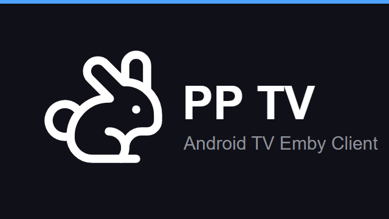

# PP TV（皮皮 TV）

PP TV 是一款面向 Android TV 的 Emby 客户端，采用与应用图标一致的蓝黑界面，同时支持电视遥控器和触摸操作。

> 使用前需要已有可访问的 Emby 服务器和账号。PP TV 不是 Emby 官方应用。

## 主要功能

- 浏览媒体库、继续观看和最新内容
- 搜索电影、剧集及其他媒体
- 查看剧集季/集信息，收藏或标记为已看
- 播放、暂停、前后跳转、倍速播放
- 切换音轨和字幕，自动同步播放进度
- 管理多个 Emby 服务器和备用线路
- 支持直播频道、DLNA 投屏、网络代理和 WebDAV 配置同步
- 支持遥控器、键盘和触摸屏操作

## 下载

请前往 [Releases](https://github.com/aenerv7/PPEmbyTV/releases/latest) 下载最新版本。

| APK | 适用设备 |
|---|---|
| `app-universal-release.apk` | 不确定设备架构时选择，推荐普通用户下载 |
| `app-arm64-v8a-release.apk` | 大多数较新的电视和电视盒子 |
| `app-armeabi-v7a-release.apk` | 较老的 32 位设备 |

系统要求：Android 6.0 或更高版本。

## 安装与登录

1. 下载 APK，并传到电视或电视盒子上。
2. 在系统设置中允许安装未知来源应用，然后安装 PP TV。
3. 打开应用，选择“添加服务器”。
4. 使用以下任一方式完成配置：
   - 手动填写 Emby 服务器地址、端口、用户名和密码。
   - 使用手机扫描电视上的二维码，在手机浏览器中填写信息。
5. 保存并连接后，即可进入首页浏览和播放媒体。

扫码配置时，手机和电视需要处于可以互相访问的同一局域网。

## 操作说明

### 电视遥控器

- 方向键：移动焦点
- 确认键：打开或执行当前操作
- 返回键：返回上一页或退出播放器
- 播放时按方向键：显示播放器控制栏

### 手机和平板

- 所有主要界面均支持触摸操作
- 应用固定使用横屏，不提供竖屏布局
- 点击输入框会使用系统键盘

## 播放器

播放器提供播放/暂停、前后 10 秒、倍速、音轨和字幕切换等常用操作。播放进度会同步回 Emby，之后可以从“继续观看”恢复播放。

能否直接播放取决于设备解码能力、媒体格式和服务器设置；无法直连时，Emby 服务器可能会进行转码。

## 常见问题

**无法连接服务器**

检查服务器地址和端口是否正确，并确认当前设备能够访问该地址。使用 HTTPS、自定义端口或代理时，也请检查对应设置。

**扫码后打不开配置页面**

确认手机和电视处于同一局域网，且路由器没有启用设备隔离。也可以改用电视端手动填写。

**视频无法播放或卡顿**

尝试调整解码设置或网络线路，并检查 Emby 服务器是否具备足够的转码能力。

**手机界面为什么不能竖屏**

PP TV 以 Android TV 为首要使用场景，手机和平板也统一使用横屏界面。

## 反馈问题

遇到问题时，请在 [Issues](https://github.com/aenerv7/PPEmbyTV/issues) 中提供设备型号、Android 版本、问题描述和复现步骤。请勿公开服务器密码、访问令牌或其他账号信息。

开发与维护说明见 [HANDOFF.md](HANDOFF.md)。

## 致谢

界面和交互参考 [ChaiChaiEmbyTV](https://github.com/dh374374/ChaiChaiEmbyTV)。感谢 Emby 与 AndroidX Media 等项目。

本项目仅供学习与交流使用。
